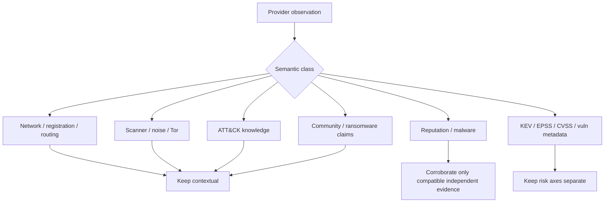
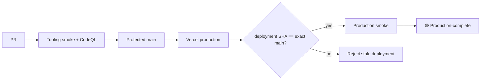
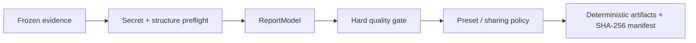

<div align="center">



# PARALLAX

**CTI Evidence Gateway**

### `BOUNDED · READ-ONLY · PROVENANCE-FIRST`

**37 fixed intelligence sources → Evidence v2 → typed correlation → STIX 2.1 → deterministic analyst reports**

[](https://github.com/ger1e/cti-enrichment-gateway/actions/workflows/tooling-smoke.yml)
[](https://github.com/ger1e/cti-enrichment-gateway/actions/workflows/codeql.yml)


**Public source · private bearer-protected runtime · fixed egress · no arbitrary provider calls · no synthetic master score**

[Brand](docs/BRAND.md) · [Architecture](docs/ARCHITECTURE.md) · [API](docs/API.md) · [Providers](docs/PROVIDERS.md) · [Evidence v2](docs/EVIDENCE-SCHEMA.md) · [E2E example](docs/END-TO-END-EXAMPLE.md) · [Operations](docs/OPERATIONS.md) · [Security](SECURITY.md)

</div>

> [!IMPORTANT]
> Built for **personal research and lab use**. Do not send commercial-client, internal-enterprise, restricted, or otherwise sensitive data unless authorization, licensing, and data-handling requirements are explicitly satisfied.

> [!NOTE]
> **PARALLAX is the product/visual identity.** Compatibility surfaces remain `cti-enrichment-gateway`, the `cti` CLI, `CTI_GATEWAY_TOKEN`, and the existing `/api/*` contracts. See [`docs/BRAND.md`](docs/BRAND.md).

## ⚡ One-screen model

| | |
| --- | --- |
| **Input** | IP · domain · URL · hash · CVE · ATT&CK ID · ASN · CIDR |
| **Profiles** | `fast` · `standard` · `full` — never arbitrary provider selection |
| **Core boundary** | `safeFetch` fixed egress + provider-specific parsing |
| **Output** | Evidence v2 · typed correlation · JSON · Batch · STIX 2.1 |
| **Operator layer** | CLI · Maltego · deterministic offline reporting |
| **Design rule** | preserve semantics, provenance, uncertainty, and explicit failure |

```text
indicator
   ↓
canonical classification
   ↓
fixed profile + bounded provider fan-out
   ↓
provider-native observations + provenance
   ↓
typed correlation / contradictions / freshness / huntability
   ↓
JSON · Batch · STIX 2.1 · frozen offline report
```

> [!TIP]
> **Absence is not benign. Context is not reputation. Infrastructure is not attribution. Claims are not proof.**

## 🛰️ Architecture

```mermaid
flowchart TB
    A[Client / CLI / Maltego] --> B[🔒 Bearer auth + request limits]
    B --> C[Canonical classifier]
    C --> D[fast / standard / full]
    D --> E[Tiered scheduler<br/>max 4 providers]
    E --> F[🧱 safeFetch fixed egress]
    F --> P[(37 fixed APIs / feeds)]
    P --> G[Provider parsers]
    G --> H[Bounded LRU / TTL cache]
    H --> I[🧬 Evidence v2 + integrity]
    I --> J[Typed correlation + huntability]
    J --> K[JSON / Batch / STIX 2.1]
    K --> L[Frozen offline report]

    style F fill:#082b2f,stroke:#00e5ff,stroke-width:3px
    style I fill:#0b2d20,stroke:#39ff88,stroke-width:2px
    style P fill:#242424,stroke:#f6c945,stroke-width:2px
```



`safeFetch` is the critical trust boundary. Callers cannot choose arbitrary providers, destinations, protocols, methods, headers, redirect targets, or provider credentials. Upstream responses remain untrusted until provider-specific parsers validate and normalize them.

**Read-only means read-only:** no scanning, detonation, submission, sample download, takedown, remediation, or arbitrary-proxy routes.

## 🧠 Semantic firewall

The gateway deliberately refuses to flatten unlike intelligence into a universal maliciousness score.



| Rule | Meaning |
| --- | --- |
| **Absence ≠ benign** | `not_listed`, `not_found`, `no_result`, and `no_association` remain absence semantics |
| **Context ≠ reputation** | RDAP, routing, Tor, exposure, Modat, and ATT&CK context cannot vote an IOC malicious |
| **Claims ≠ compromise proof** | community reports and ransomware posts remain neutral claim/report evidence |
| **Infrastructure ≠ attribution** | hosting, ASN, DNS, certificate, or malware proximity cannot manufacture actor attribution |
| **KEV ≠ EPSS ≠ CVSS** | exploitation status, probability, and severity remain separate risk axes |
| **Failure ≠ negative evidence** | timeout, 429, 5xx, parser failure, and circuit-open states remain explicit coverage failures |

Full contract: [`docs/EVIDENCE-SCHEMA.md`](docs/EVIDENCE-SCHEMA.md).

## 🎯 Supported pivots

| Pivot | Support | Typical intelligence |
| --- | :---: | --- |
| IPv4 / IPv6 | 🟢 | identity, routing, exposure, abuse, reputation, passive DNS |
| Domain / DNS | 🟢 | infrastructure, phishing, reputation, ransomware context |
| HTTP(S) URL | 🟢 | URL intelligence, phishing/malware, community context |
| MD5 / SHA-1 / SHA-256 | 🟢 | sample, catalog, malware, sandbox context |
| CVE | 🟢 | KEV, EPSS, NVD/CIRCL/OSV metadata |
| MITRE ATT&CK ID | 🟢 | fixed TAXII knowledge lookup |
| ASN | 🟢 | registration, routing, DROP context |
| IPv4 / IPv6 CIDR | 🟢 | registration, routing, DROP context |
| TLS / JA3 | ⚪ omitted | no fixed bounded source passed the source gate |

## 🔌 API surface

| Endpoint | Auth | Purpose | Hard boundary |
| --- | :---: | --- | --- |
| `GET /api/meta` | public | static capabilities + limits | no secret/configuration state |
| `GET /api/health` | 🔒 | readiness | `no-store`, no credential values |
| `GET /api/status` | 🔒 | aggregate runtime state | count-only cache/circuit/config state |
| `POST /api/enrich` | 🔒 | one indicator | fixed workflow/profile only |
| `POST /api/batch` | 🔒 | 1–20 indicators | max 3 active indicators / 200 calls |
| `POST /api/stix` | 🔒 | enrich → STIX 2.1 | max 100 objects |
| unknown `/api/*` | — | controlled rejection | fail-closed 404 |

Profiles are fixed: **`fast` · `standard` · `full`**. A caller cannot name an upstream provider or override egress policy.

```json
{"indicator":"203.0.113.10","profile":"standard"}
```

Complete endpoint/error contract: [`docs/API.md`](docs/API.md).

## 🌐 37 upstream APIs and feeds

Provider routing is static and manifest-driven. **Configured state and live upstream health are intentionally not hardcoded here** because they can change independently of source code.

| Intelligence lane | Active integrations |
| --- | --- |
| 🌍 **Identity / routing / exposure** | IPinfo · RDAP · RIPEstat · Shodan · Censys · Modat Magnify · Cloudflare Radar · Tor Exit · Spamhaus DROP / ASN-DROP |
| ☣️ **Threat / IOC context** | DShield · Feodo Tracker · ThreatMiner · CIRCL MISP OSINT · Botvrij MISP OSINT · GreyNoise · AbuseIPDB · VirusTotal · OTX · ThreatFox · urlscan.io · Webamon · Pulsedive · OpenPhish · URLhaus · TweetFeed |
| 🧬 **File / malware** | CIRCL Hashlookup · MalwareBazaar · Malpedia · Hybrid Analysis |
| 🛡️ **Vulnerability / ATT&CK** | CISA KEV · FIRST EPSS · CIRCL Vulnerability-Lookup · NVD · OSV · MITRE ATT&CK TAXII |
| 💀 **Ransomware** | RansomLook · Ransomware.live API-PRO |

[`config/providers.json`](config/providers.json) is the canonical machine-readable policy: supported types, observation semantics, credential identifiers, tiers, cost classes, timeouts, probe pacing, cache TTLs, response ceilings, exact hosts/methods/protocols, parser versions, source URLs, and distribution rules.

> [!CAUTION]
> **Implemented ≠ configured ≠ production-verified.** Source presence, runtime secret state, and exact-deployment acceptance are separate facts.

## 🧱 Security model

```text
CLIENT                       VERCEL RUNTIME                    UPSTREAM

CTI_GATEWAY_TOKEN ──► auth ─► workflow ─► safeFetch ─────────► fixed APIs
                                  │
                                  └── vendor credentials stay server-side
```

| Boundary | Enforced control |
| --- | --- |
| 🔒 Authentication | bearer required for private API surfaces |
| 🔑 Provider secrets | stay server-side; Maltego receives only the gateway bearer |
| 🧱 Egress | exact fixed hosts + declared HTTPS methods/protocols |
| ↪ Redirects | refused |
| 📦 Upstream bodies | streamed and byte-capped before parsing |
| ⏱ Runtime | provider timeout + 20 s request deadline |
| 🧵 Concurrency | max 4 providers; batch max 3 active indicators |
| 🔁 Retry | at most one retry for explicitly retryable conditions |
| 🧯 Circuit breaker | bounded and instance-local |
| 🗄 Cache | bounded LRU/TTL + in-flight dedupe; provider failures are never cached |
| 🧪 Parsing | malformed public feeds fail closed |
| 🕵️ Telemetry | allowlisted operational fields; raw indicators excluded by default |
| 🌐 Errors | `no-store`, CSP, frame denial, `nosniff`, correlation IDs, no raw provider exception leakage |

Runtime parity is **Node.js 24.x**. GitHub Actions are pinned to immutable commit SHAs. npm state is lockfile-backed and CI performs a real production dependency audit.

Security detail: [`docs/SECURITY-CONTROLS.md`](docs/SECURITY-CONTROLS.md) · [`docs/THREAT-MODEL.md`](docs/THREAT-MODEL.md) · [`SECURITY.md`](SECURITY.md)

## 🧪 Verification & release

Current protected-`main` automated baseline:

| Gate | Baseline |
| --- | ---: |
| Node tests | **342 / 342** 🟢 |
| Maltego tests | **65 / 65** 🟢 |
| npm production audit | **0 vulnerabilities** 🟢 |
| Repository invariants | 🟢 |
| Public-release audit | 🟢 |
| Python compilation | 🟢 |
| ShellCheck / bash syntax | 🟢 |
| PowerShell parsing | 🟢 |
| CodeQL | 🟢 live badge above |

`Tooling smoke` is intentionally one bounded Ubuntu job. It verifies the repository/Node suite, Maltego regression tests, Python compilation, shell checks, and PowerShell parsing without recurring macOS/Windows hosted-runner spend.



**Repository-complete ≠ configured ≠ production-complete.** Production acceptance requires an exact deployed source SHA, not merely green repository CI. See [`docs/OPERATIONS.md`](docs/OPERATIONS.md).

<details>
<summary><strong>🧰 Operator CLI + provider readiness</strong></summary>

Routine operations stay behind a bounded, dependency-free control plane:

```text
cti doctor
cti providers list
cti providers env-template
cti providers probe --all
cti maltego check
cti release verify
cti setup
cti repair
cti report compile <snapshot.json> --out <dir> [--preset <name>]
cti report diff <before.json> <after.json>
```

`doctor` reports configuration presence/counts only. The sequential provider probe distinguishes `ok`, `unconfigured`, `auth_failed`, `rate_limited`, `timeout`, `upstream_error`, and `contract_error` without printing secret values or raw exception text.

</details>

<details>
<summary><strong>🕸️ Maltego boundary + setup</strong></summary>

Maltego crosses **one credential boundary only**: `CTI_GATEWAY_TOKEN`. Vendor credentials never enter the MTZ or project output.

```sh
# macOS / Linux
cd maltego && ./install.sh
```

```powershell
# Windows
cd maltego
Set-ExecutionPolicy -Scope Process Bypass -Force
.\install.ps1
```

The bootstrap enforces Python ≥3.10, prefers 3.12, repairs stale environments, runs tests, uses native credential storage, generates the MTZ, checks archive safety/transform parity/secret absence, and prints the resulting SHA-256.

See [`maltego/README.md`](maltego/README.md).

</details>

<details>
<summary><strong>📦 Deterministic offline reports</strong></summary>

Report rendering never calls providers. It compiles from a **frozen evidence snapshot** through a canonical `ReportModel` and hard quality gate.



`cti report compile` can emit:

```text
report.html              intelligence.stix.json
report.pdf               observables.csv
report.txt               hunts.kql
evidence.json            attack-navigator.json
manifest.json
```

The gate rejects orphan claims, missing provenance, malformed ATT&CK IDs, contextual behavior presented as observed, duplicate observables, impossible timestamps, unsafe references, unsupported attribution, stale evidence without limitation, secret material, and unsafe sharing of `internal` / `internal_only` evidence.

CSV export neutralizes spreadsheet-formula prefixes. Snapshot diffing reports structural evidence change without inventing a risk-score delta.

</details>

<details>
<summary><strong>🚀 Deployment, governance, and development verification</strong></summary>

Production is deliberately narrower than CI:

```text
feature / PR ─────► GitHub validation
               └─X Vercel preview

protected main ───► GitHub validation
               └─► one Vercel production build
```

`vercel.json` denies Git deployment for `**` and explicitly enables only `main`.

```powershell
Set-ExecutionPolicy -Scope Process Bypass -Force
.\scripts\bootstrap-vercel.ps1
.\scripts\finalize.ps1
```

```bash
npm run verify:governance
```

Tagged `v*` releases use [`.github/workflows/release-provenance.yml`](.github/workflows/release-provenance.yml) to verify exact source, run checks/audit, validate [`release-manifest.json`](release-manifest.json), generate CycloneDX + SPDX SBOMs, record provenance/checksums, and publish GitHub Release assets.

Full repository verification:

```bash
npm run bootstrap
npm run verify:tooling
npm run verify:repo
npm run verify:deps
npm run lint:shell
npm run audit:public
npm run check
npm test
node scripts/generate-release-manifest.mjs --check
```

```bash
cd maltego
python3 -m unittest discover -s tests -v
cd ..
python3 -m compileall -q maltego
```

</details>

## 📚 Deep docs

| Document | Purpose |
| --- | --- |
| [`docs/BRAND.md`](docs/BRAND.md) | PARALLAX identity, color, motion, logo, and compatibility rules |
| [`docs/ARCHITECTURE.md`](docs/ARCHITECTURE.md) | execution model + trust boundaries |
| [`docs/END-TO-END-EXAMPLE.md`](docs/END-TO-END-EXAMPLE.md) | IOC → evidence → STIX/report walkthrough |
| [`docs/EVIDENCE-SCHEMA.md`](docs/EVIDENCE-SCHEMA.md) | Evidence v2 + correlation semantics |
| [`docs/PROVIDERS.md`](docs/PROVIDERS.md) | source semantics + provider state model |
| [`docs/API.md`](docs/API.md) | endpoint contracts + hard limits |
| [`docs/THREAT-MODEL.md`](docs/THREAT-MODEL.md) | threats + residual risk + executable checks |
| [`docs/SECURITY-CONTROLS.md`](docs/SECURITY-CONTROLS.md) | control → risk mapping |
| [`docs/OPERATIONS.md`](docs/OPERATIONS.md) | CI + production acceptance + incident behavior |
| [`SECURITY.md`](SECURITY.md) | repository security policy |
| [`docs/PUBLIC-RELEASE-CHECKLIST.md`](docs/PUBLIC-RELEASE-CHECKLIST.md) | public-extraction gate |
| [`release-manifest.json`](release-manifest.json) | deterministic release identity |

The executable registry, canonical provider manifest, workflows, and release manifest are authoritative. Documentation never overrides runtime/configuration checks.

## 🚧 Deliberate gaps

No TLS/JA3 without a bounded source that passes the source gate. No deprecated SSLBL C2 path. No stale SecurityTrails configuration. No unbounded ATT&CK relationship download. No ransomware-wide enumeration in per-indicator enrichment. No Modat bulk export or broad history path. **No universal maliciousness score.**

---

<div align="center">


### `OBSERVED ≠ INFERRED ≠ CONTEXTUAL`

**Preserve provenance · keep semantics separate · fail closed · make uncertainty visible**

</div>
