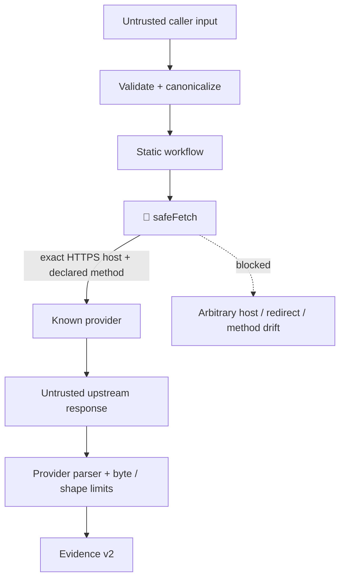
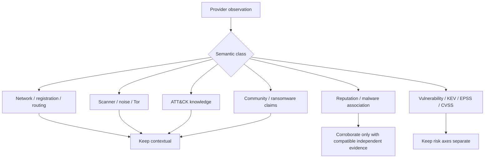
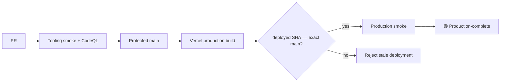
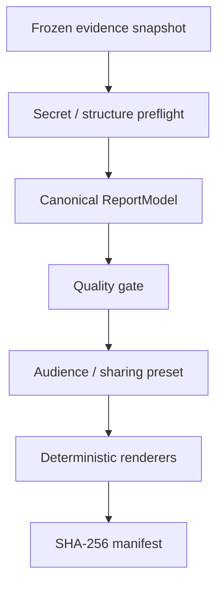

<div align="center">

# CTI ENRICHMENT GATEWAY

**37 fixed intelligence sources → evidence-v2 → typed correlation → STIX 2.1 → deterministic analyst reports**

[](https://github.com/ger1e/cti-enrichment-gateway/actions/workflows/tooling-smoke.yml)
[](https://github.com/ger1e/cti-enrichment-gateway/actions/workflows/codeql.yml)


**Public source. Private bearer-protected runtime. Fixed egress. No arbitrary provider calls. No synthetic “vendors say malicious” score.**

[Architecture](docs/ARCHITECTURE.md) · [API](docs/API.md) · [Providers](docs/PROVIDERS.md) · [Evidence v2](docs/EVIDENCE-SCHEMA.md) · [E2E example](docs/END-TO-END-EXAMPLE.md) · [Operations](docs/OPERATIONS.md) · [Security](SECURITY.md)

</div>

---

> [!IMPORTANT]
> This gateway is built for **personal research and lab use**. Do not send commercial-client, internal-enterprise, restricted, or otherwise sensitive data unless the relevant authorization, licensing, and data-handling requirements are explicitly satisfied.

## ⚡ What this is

A bounded, read-only CTI enrichment gateway for Vercel with a local Maltego Graph Desktop client, a dependency-free operator CLI, STIX 2.1 export, and a deterministic offline report compiler.

The design goal is not “query everything and average the answers.” It is:

```text
INPUT
  ↓
canonical indicator
  ↓
fixed workflow + bounded provider fan-out
  ↓
provider-native observations + provenance
  ↓
typed correlation / contradictions / freshness / huntability
  ↓
JSON · Batch · STIX 2.1 · offline report bundle
```

### Visual legend

| Cue | Meaning |
| --- | --- |
| 🟢 | enforced / verified / bounded |
| 🟡 | partial coverage, upstream state, or analyst caveat |
| 🔒 | authentication / secret boundary |
| 🧱 | fail-closed security boundary |
| 🧭 | context for investigation, **not** a maliciousness verdict |
| 🧬 | normalized evidence / provenance / integrity |

---

## 🛰️ Architecture at a glance

```mermaid
flowchart TB
    A[Client / CLI / Maltego] --> B[🔒 Bearer auth + request limits]
    B --> C[Canonical indicator classifier]
    C --> D[Fixed fast / standard / full profile]
    D --> E[Tiered scheduler<br/>max 4 providers]
    E --> F[🧱 safeFetch fixed-egress boundary]
    F --> P[(37 fixed APIs / feeds)]
    P --> G[Provider-specific parsers]
    G --> H[Bounded LRU / TTL cache]
    H --> I[🧬 Evidence v2 + integrity fingerprint]
    I --> J[Typed correlation + freshness + huntability]
    J --> K[JSON / Batch / STIX 2.1]
    K --> L[Optional frozen offline report]

    style F fill:#082b2f,stroke:#00e5ff,stroke-width:3px
    style I fill:#0b2d20,stroke:#39ff88,stroke-width:2px
    style P fill:#242424,stroke:#f6c945,stroke-width:2px
```



### The critical trust boundary

`safeFetch` is the center of gravity. Callers **cannot** choose an arbitrary provider, destination, protocol, method, header, redirect target, or provider credential.



**Read-only means read-only:** there are no scanning, detonation, submission, sample-download, takedown, remediation, or arbitrary-proxy routes.

---

## 🧠 Semantic firewall

The gateway deliberately refuses to collapse unlike evidence into one global risk score.



### The rules that matter

- **Absence ≠ benign.** `not_listed`, `not_found`, `no_result`, and `no_association` are semantic absence, never a clean verdict by default.
- **Context ≠ reputation.** RDAP registration, Tor exit status, Shodan exposure, Modat infrastructure, or ATT&CK knowledge cannot vote an IOC malicious.
- **Claims ≠ compromise proof.** Ransomware leak-site and community IOC reports stay neutral claim/report semantics.
- **Infrastructure ≠ attribution.** ASN, hosting, DNS, certificate, or malware proximity cannot create actor attribution without explicit supporting relationships.
- **KEV ≠ EPSS ≠ CVSS.** Exploited status, exploitation probability, and severity stay separate axes.

See [`docs/EVIDENCE-SCHEMA.md`](docs/EVIDENCE-SCHEMA.md) for the full evidence-v2 contract.

---

## 🎯 Supported pivots

| Indicator | Canonical support | Typical intelligence |
| --- | :---: | --- |
| IPv4 / IPv6 | 🟢 | identity, routing, exposure, abuse, reputation, passive DNS |
| Domain / DNS | 🟢 | DNS/infrastructure, phishing, reputation, ransomware claims |
| HTTP(S) URL | 🟢 | URL intelligence, phishing/malware context, community reports |
| MD5 / SHA-1 / SHA-256 | 🟢 | malware/sample intelligence, sandbox/catalog context |
| CVE | 🟢 | KEV, EPSS, NVD/CIRCL/OSV metadata |
| MITRE ATT&CK ID | 🟢 | fixed TAXII knowledge lookup |
| ASN | 🟢 | registration, routing, DROP context |
| IPv4 / IPv6 CIDR | 🟢 | registration, routing, DROP context |
| TLS / JA3 | ⚪ intentionally omitted | no fixed bounded source met the source gate |

---

## 🔌 API surface

| Endpoint | Auth | Purpose | Hard boundary |
| --- | :---: | --- | --- |
| `GET /api/meta` | public | static capabilities + limits | no secret/configuration state |
| `GET /api/health` | 🔒 | operational readiness | `no-store`, no credential values |
| `GET /api/status` | 🔒 | aggregate runtime state | count-only cache/circuit/config state |
| `POST /api/enrich` | 🔒 | one indicator | fixed workflow/profile only |
| `POST /api/batch` | 🔒 | 1–20 indicators | max 3 active indicators / 200 calls |
| `POST /api/stix` | 🔒 | enrich → STIX 2.1 | max 100 objects |
| unknown `/api/*` | — | controlled rejection | fail-closed 404 |

Profiles are fixed: **`fast` · `standard` · `full`**. A caller cannot name an upstream provider or override egress policy.

```json
{
  "indicator": "203.0.113.10",
  "profile": "standard"
}
```

For the complete request/error contract, see [`docs/API.md`](docs/API.md).

---

## 🌐 37 upstream APIs and feeds

Provider routing is static and manifest-driven. **Configured state and live upstream health are intentionally not hardcoded into this README** because both can change independently of source code.

| Intelligence lane | Active integrations |
| --- | --- |
| 🌍 **Network identity / routing / exposure** | IPinfo · RDAP · RIPEstat · Shodan · Censys · Modat Magnify · Cloudflare Radar · Tor Exit · Spamhaus DROP / ASN-DROP |
| ☣️ **Threat reputation / IOC context** | DShield · Feodo Tracker · ThreatMiner · CIRCL MISP OSINT · Botvrij MISP OSINT · GreyNoise · AbuseIPDB · VirusTotal · OTX · ThreatFox · urlscan.io · Webamon · Pulsedive · OpenPhish · URLhaus · TweetFeed |
| 🧬 **File / malware intelligence** | CIRCL Hashlookup · MalwareBazaar · Malpedia · Hybrid Analysis |
| 🛡️ **Vulnerability / ATT&CK** | CISA KEV · FIRST EPSS · CIRCL Vulnerability-Lookup · NVD · OSV · MITRE ATT&CK TAXII |
| 💀 **Ransomware intelligence** | RansomLook · Ransomware.live API-PRO |

The canonical machine-readable contract is [`config/providers.json`](config/providers.json): supported types, observation semantics, credential identifiers, tiers, cost classes, timeouts, probe pacing, cache TTLs, response ceilings, exact hosts, methods, protocols, parser versions, source URLs, and distribution policy.

> [!NOTE]
> Tier is execution priority/cost policy—not analytical authority. A tier-1 source is not automatically “more trusted” than a tier-4 source.

---

## 🧱 Security model

```text
CALLER SECRET          CTI_GATEWAY_TOKEN
      │
      ▼
┌───────────────────────────────────────────┐
│              GATEWAY RUNTIME              │
│                                           │
│  auth → classify → workflow → safeFetch   │
│                           │               │
│                     vendor secrets        │
└───────────────────────────┼───────────────┘
                            ▼
                    FIXED UPSTREAM APIs
```

### Enforced controls

| Boundary | Control |
| --- | --- |
| 🔒 Authentication | private API requires `CTI_GATEWAY_TOKEN` |
| 🔑 Provider secrets | stay server-side; never enter Maltego project/MTZ output |
| 🧱 Egress | exact fixed hosts + declared HTTPS methods/protocols |
| ↪ Redirects | refused |
| 📦 Upstream bodies | streamed and byte-capped before parsing |
| ⏱ Runtime | provider timeout + 20 s request deadline |
| 🧵 Concurrency | max 4 providers; batch max 3 active indicators |
| 🔁 Retry | at most one retry for explicitly retryable conditions |
| 🧯 Circuit breaker | bounded, instance-local, retryable-failure driven |
| 🗄 Cache | bounded LRU/TTL + in-flight de-duplication |
| 🧪 Parser behavior | malformed feeds fail closed |
| 🕵️ Telemetry | allowlisted operational fields; raw indicators excluded by default |
| 🌐 HTTP errors | `no-store`, CSP-locked, frame-denied, `nosniff`, correlation-ID tagged |

Runtime parity is **Node.js 24.x**. GitHub Actions are pinned to immutable commit SHAs. npm state is lockfile-backed and CI runs a real `npm audit --omit=dev`.

Security details: [`docs/SECURITY-CONTROLS.md`](docs/SECURITY-CONTROLS.md) · [`docs/THREAT-MODEL.md`](docs/THREAT-MODEL.md) · [`SECURITY.md`](SECURITY.md)

---

## 🧪 QA / verification posture

Current automated baseline on protected `main`:

| Gate | Baseline |
| --- | ---: |
| Node test suite | **342 / 342** 🟢 |
| Maltego Python suite | **65 / 65** 🟢 |
| npm production audit | **0 vulnerabilities** 🟢 |
| Repository invariants | 🟢 |
| Public-release audit | 🟢 |
| Python compilation | 🟢 |
| ShellCheck / bash syntax | 🟢 |
| PowerShell syntax | 🟢 |
| CodeQL | 🟢 live badge above |

`Tooling smoke` is intentionally one bounded Ubuntu job. It verifies Node/repository/MAXX invariants, Maltego regression tests, Python compilation, shell checks, and PowerShell parsing without recurring macOS/Windows hosted-runner spend.

### Production acceptance is stricter than CI



Repository-complete, configured, and production-complete are separate states. See [`docs/OPERATIONS.md`](docs/OPERATIONS.md).

---

## 🧰 Operator CLI

Routine operations stay behind a bounded, dependency-free control plane:

```text
cti doctor
cti providers list
cti providers env-template
cti providers probe --all
cti maltego check
cti release verify
cti setup
cti repair
cti report compile <snapshot.json> --out <dir> [--preset <name>]
cti report diff <before.json> <after.json>
```

`doctor` reports configuration presence/counts only. The sequential provider probe classifies `ok`, `unconfigured`, `auth_failed`, `rate_limited`, `timeout`, `upstream_error`, and `contract_error` without printing secret values or raw exception text.

---

## 🕸️ Maltego boundary

Maltego knows **one credential only**: the gateway bearer. Vendor API keys remain in the server-side runtime.

### macOS / Linux

```sh
cd maltego
./install.sh
```

### Windows PowerShell

```powershell
cd maltego
Set-ExecutionPolicy -Scope Process Bypass -Force
.\install.ps1
```

The bootstrap enforces Python ≥3.10, prefers 3.12, repairs stale virtual environments, runs tests, uses the native credential store, generates the MTZ, validates archive safety/transform inventory/secret absence, and prints the resulting SHA-256.

See [`maltego/README.md`](maltego/README.md).

---

## 📦 Decision-grade offline reports

Report rendering never calls providers. It compiles from a **frozen evidence snapshot** through a canonical `ReportModel` and hard quality gate.



The `all` preset can emit:

```text
report.html
report.pdf
report.txt
evidence.json
intelligence.stix.json
observables.csv
hunts.kql
attack-navigator.json
manifest.json
```

The gate rejects orphan claims, missing provenance, malformed ATT&CK IDs, contextual behavior represented as observed, duplicate observables, impossible timestamps, unsafe references, unsupported attribution, stale evidence without an explicit limitation, known secret material, and unsafe sharing of `internal` / `internal_only` evidence.

CSV export neutralizes spreadsheet-formula prefixes. Snapshot diffing reports structural evidence change without inventing a risk-score delta.

---

## 🚀 Deployment / governance

Production is deliberately narrower than CI:

```text
feature branch / PR ──► GitHub validation
                    └─X Vercel preview build

protected main ───────► GitHub validation
                    └─► one Vercel production build
```

`vercel.json` denies Git deployment for `**` and explicitly permits only `main`, closing slash-branch preview loopholes while allowing the protected production path.

The authorized Windows provisioning/finalization path is:

```powershell
Set-ExecutionPolicy -Scope Process Bypass -Force
.\scripts\bootstrap-vercel.ps1
.\scripts\finalize.ps1
```

Branch/deployment governance can be checked read-only with:

```bash
npm run verify:governance
```

Tagged `v*` releases use [`.github/workflows/release-provenance.yml`](.github/workflows/release-provenance.yml) to verify the exact source, run dependency/full checks, validate [`release-manifest.json`](release-manifest.json), generate CycloneDX + SPDX SBOMs, record provenance/checksums, and attach assets to the GitHub Release.

---

## 🧭 Quick development verification

```bash
npm run bootstrap
npm run verify:tooling
npm run verify:repo
npm run verify:deps
npm run lint:shell
npm run audit:public
npm run check
npm test
node scripts/generate-release-manifest.mjs --check
```

Maltego:

```bash
cd maltego
python3 -m unittest discover -s tests -v
cd ..
python3 -m compileall -q maltego
```

---

## 📚 Deep documentation

| Document | Use it for |
| --- | --- |
| [`docs/ARCHITECTURE.md`](docs/ARCHITECTURE.md) | execution model + trust boundaries |
| [`docs/END-TO-END-EXAMPLE.md`](docs/END-TO-END-EXAMPLE.md) | sanitized IOC → evidence → STIX/report walkthrough |
| [`docs/EVIDENCE-SCHEMA.md`](docs/EVIDENCE-SCHEMA.md) | evidence-v2 semantics + correlation model |
| [`docs/PROVIDERS.md`](docs/PROVIDERS.md) | provider semantics + state model |
| [`docs/API.md`](docs/API.md) | endpoint contracts + hard limits |
| [`docs/THREAT-MODEL.md`](docs/THREAT-MODEL.md) | threats, controls, residual risk, executable checks |
| [`docs/SECURITY-CONTROLS.md`](docs/SECURITY-CONTROLS.md) | control → risk mapping |
| [`docs/OPERATIONS.md`](docs/OPERATIONS.md) | CI, production acceptance, incident behavior |
| [`SECURITY.md`](SECURITY.md) | repository security policy |
| [`PUBLIC-RELEASE-CHECKLIST.md`](PUBLIC-RELEASE-CHECKLIST.md) | public-extraction gate |
| [`release-manifest.json`](release-manifest.json) | deterministic gateway/provider release identity |

The executable provider registry, canonical provider manifest, workflows, and release manifest are authoritative. Documentation never overrides runtime/configuration checks.

---

## 🚧 Deliberate gaps

These are intentional design decisions, not forgotten TODOs:

- no TLS / JA3 indicator class without a fixed bounded source that passes the source gate;
- no deprecated SSLBL C2 path;
- no stale SecurityTrails configuration;
- no unbounded ATT&CK relationship collection download;
- no ransomware-wide unbounded group/IOC enumeration inside per-indicator enrichment;
- no Modat bulk export or broad history/search workflow;
- no universal maliciousness score.

---

<div align="center">

### `OBSERVED ≠ INFERRED ≠ CONTEXTUAL`

**Preserve provenance. Keep semantics separate. Fail closed. Make uncertainty visible.**

</div>
