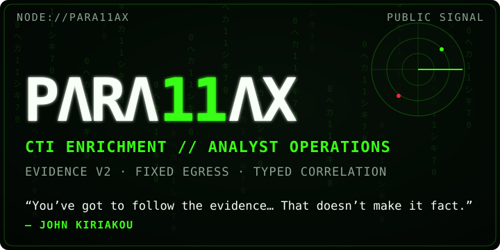
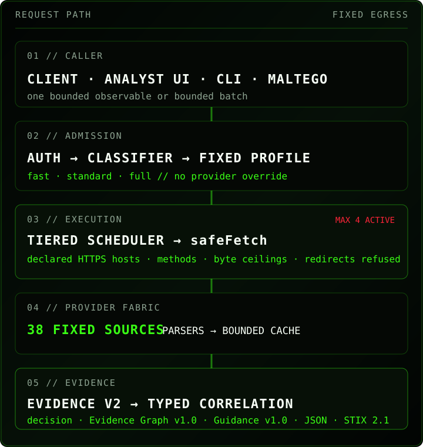
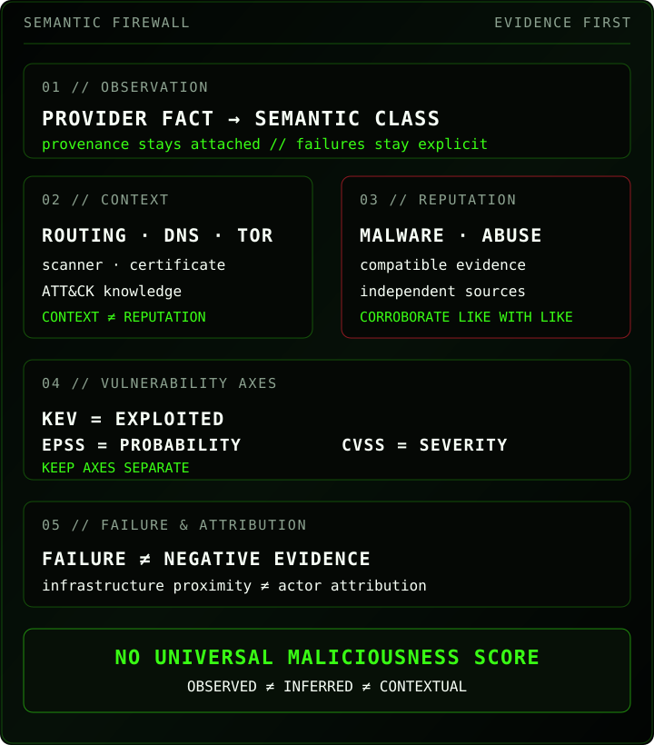

<p align="center">
  
</p>

<p align="center">
  <a href="https://github.com/ger1e/para11ax/actions/workflows/tooling-smoke.yml"></a>
  <a href="https://github.com/ger1e/para11ax/actions/workflows/codeql.yml"></a>
</p>

<p align="center"><sub>
  <a href="https://para11ax.vercel.app/app/"><strong>ENTER ANALYST UI</strong></a> ·
  <a href="https://para11ax.vercel.app/">LANDING</a> ·
  <a href="docs/API.md">API</a> ·
  <a href="docs/ARCHITECTURE.md">ARCHITECTURE</a> ·
  <a href="docs/PROVIDERS.md">PROVIDERS</a> ·
  <a href="SECURITY.md">SECURITY</a>
</sub></p>

> [!IMPORTANT]
> Personal research / lab surface. Do not send commercial-client, internal-enterprise, restricted, or otherwise sensitive data without explicit authorization and suitable data handling.

<sub><strong>01 // SYSTEM PROFILE</strong></sub>

PARA11AX is a bounded, read-only CTI enrichment and correlation platform for hunters and defenders. One supported observable enters a fixed workflow; provider-native evidence leaves with provenance, typed semantics, explicit uncertainty and explicit coverage failure.

<sub><strong>STATE</strong> — OPERATIONAL CORE<br/>
<strong>INPUTS</strong> — `ip` · `domain` · `url` · `hash` · `cve` · `attack` · `asn` · `cidr` · `certificate` (`cert-sha256:&lt;64-hex&gt;`)<br/>
<strong>PROFILES</strong> — `fast` · `standard` · `full`; callers cannot select arbitrary providers<br/>
<strong>OUTPUT</strong> — Evidence v2 · Evidence Graph v1.0 · Guidance v1.0 · deterministic decision support · JSON · batch · STIX 2.1 · deterministic reports<br/>
<strong>LOCAL</strong> — browser-local cases · snapshots/diffs · exact typed cross-case index · case graph · `.para11ax` bundles; no server-side case persistence<br/>
<strong>IDENTITY</strong> — repository/package/CLI `para11ax` · bearer `PARA11AX_TOKEN` · API `/api/para11ax/*`</sub>

<sub><strong>02 // REQUEST PATH</strong></sub>

<p align="center"></p>

`safeFetch` is the hard egress boundary. Callers cannot choose arbitrary destinations, protocols, methods, headers, redirects, provider credentials or custom proxy routes. Upstream responses remain untrusted until a provider parser validates and normalizes them.

**Read-only means read-only:** no scanning, detonation, submission, sample download, takedown, remediation or arbitrary proxying.

<details>
<summary><strong>API surface</strong></summary>

- `GET /api/para11ax/meta` — public static capabilities and hard limits.
- `GET /api/para11ax/health` — bearer-protected readiness.
- `GET /api/para11ax/status` — bearer-protected aggregate runtime state.
- `POST /api/para11ax/enrich` — one indicator, fixed workflow/profile only.
- `POST /api/para11ax/batch` — 1–20 indicators; max 3 active indicators / 200 calls.
- `POST /api/para11ax/stix` — enrich then export STIX 2.1; max 100 objects.
- Unknown `/api/para11ax/*` — controlled fail-closed API 404; browser content negotiation never changes API status semantics.

```json
{"indicator":"203.0.113.10","profile":"standard"}
```

Normalized `ok`/`partial` enrichments retain Evidence v2 and `decision` while additively exposing `evidenceGraph` (v1.0) and `guidance` (v1.0). Error envelopes do not manufacture those projections.

Complete contract: [`docs/API.md`](docs/API.md).

</details>

<sub><strong>03 // ANALYST SURFACE</strong></sub>

**ANALYST SURFACE** — [https://para11ax.vercel.app/app/](https://para11ax.vercel.app/app/)

The production terminal keeps the gateway bearer in volatile memory only, exposes bounded shell commands and evidence views, and preserves the API semantic model. The IndexedDB-backed case workspace is browser-local; active-case state and gateway authentication remain runtime-only.

<sub><strong>PROMPT</strong> — `analyst@para11ax:~$`<br/>
<strong>WORKSPACE</strong> — local cases · pins · snapshots · semantic diffs · exact sightings · case graph<br/>
<strong>BOUNDARY</strong> — not a general-purpose shell or arbitrary network client</sub>

<details>
<summary><strong>Operator CLI</strong></summary>

```text
para11ax doctor
para11ax providers list
para11ax providers env-template
para11ax providers probe --all
para11ax maltego check
para11ax release verify
para11ax report compile <snapshot.json> --out <dir> [--preset <name>]
para11ax report diff <before.json> <after.json>
```

</details>

<sub><strong>04 // SEMANTIC FIREWALL</strong></sub>

<p align="center"></p>

<sub><strong>ABSENCE ≠ BENIGN</strong> — `not_listed`, `not_found`, `no_result` and `no_association` remain absence semantics<br/>
<strong>CONTEXT ≠ REPUTATION</strong> — routing, registration, Tor, scanners, certificate metadata and ATT&CK cannot vote an IOC malicious<br/>
<strong>CLAIMS ≠ COMPROMISE PROOF</strong> — community and ransomware reporting remain claim/report evidence<br/>
<strong>INFRASTRUCTURE ≠ ATTRIBUTION</strong> — hosting, ASN, DNS, certificates and malware proximity do not manufacture actor attribution<br/>
<strong>KEV ≠ EPSS ≠ CVSS</strong> — exploitation status, probability and severity remain separate axes<br/>
<strong>FAILURE ≠ NEGATIVE EVIDENCE</strong> — timeout, 429, 5xx, parser failure and circuit-open states remain explicit coverage failures</sub>

**No universal maliciousness score.** Correlation, decision support, graphs and guidance keep analytical dimensions separate. Full semantics: [`docs/EVIDENCE-SCHEMA.md`](docs/EVIDENCE-SCHEMA.md).

<sub><strong>05 // PROVIDER FABRIC</strong></sub>

PARA11AX has **38 configured sources** across network identity, threat/IOC context, malware intelligence, vulnerability knowledge and ransomware reporting. Configuration, implementation and production verification remain distinct states.

<details>
<summary><strong>38 upstream APIs and feeds</strong></summary>

**Identity / routing / exposure:** IPinfo · RDAP · RIPEstat · Shodan · Censys · Modat Magnify · Cloudflare Radar · Cloudflare DNS · Tor Exit · Spamhaus DROP / ASN-DROP.

**Threat / IOC:** DShield · Feodo Tracker · ThreatMiner · CIRCL MISP OSINT · Botvrij MISP OSINT · GreyNoise · AbuseIPDB · VirusTotal · OTX · ThreatFox · urlscan.io · Webamon · Pulsedive · OpenPhish · URLhaus · TweetFeed.

**File / malware:** CIRCL Hashlookup · MalwareBazaar · Malpedia · Hybrid Analysis.

**Vulnerability / ATT&CK:** CISA KEV · FIRST EPSS · CIRCL Vulnerability-Lookup · NVD · OSV · MITRE ATT&CK TAXII.

**Ransomware:** RansomLook · Ransomware.live API-PRO.

[`config/providers.json`](config/providers.json) is the machine-readable policy for supported types, evidence semantics, tiers, timeouts, pacing, cache TTLs, response ceilings, fixed hosts/methods/protocols, parser versions, source URLs and distribution rules.

**Implemented ≠ configured ≠ production-verified.** Source presence, runtime secret state and exact-deployment acceptance remain separate facts.

</details>

<sub><strong>06 // SECURITY & VERIFICATION</strong></sub>

<sub><strong>AUTH</strong> — bearer protects private API surfaces; `/api/para11ax/meta` is intentionally public<br/>
<strong>EGRESS</strong> — exact fixed HTTPS hosts and declared methods/protocols; redirects refused; streamed bodies byte-capped before parsing<br/>
<strong>EXECUTION</strong> — 20 s request deadline · max 4 providers concurrently · at most one retry for explicitly retryable conditions<br/>
<strong>STATE</strong> — bounded instance-local circuit breaker and bounded LRU/TTL cache; provider failures never become cached negative evidence<br/>
<strong>TELEMETRY</strong> — allowlisted operational fields; raw indicators excluded by default; error responses are `no-store` and correlation-safe<br/>
<strong>CI</strong> — protected `main` requires Tooling smoke; CodeQL runs alongside it<br/>
<strong>DEPLOY</strong> — Vercel Git deployment is disabled for feature branches and enabled only for `main`</sub>

<details>
<summary><strong>Maltego and deterministic reports</strong></summary>

Maltego crosses one credential boundary only: `PARA11AX_TOKEN`. Vendor credentials never enter the MTZ or transform output. All nine gateway workflow types have intended transform coverage; certificate SHA-256 uses `EnrichCertificate` and explicit `cert-sha256:` transport while file hashes retain `EnrichHash` semantics. See [`maltego/README.md`](maltego/README.md).

Report rendering never calls providers. It compiles frozen evidence through a canonical `ReportModel` and hard quality gate into deterministic HTML, PDF, text, JSON/STIX, CSV, KQL, ATT&CK Navigator and SHA-256 manifest artifacts.

The gate rejects missing provenance, unsafe attribution, malformed ATT&CK IDs, impossible timestamps, duplicate observables, unsafe references, secret material, stale evidence presented as current and unsafe sharing of restricted evidence.

</details>

<sub>[SECURITY CONTROLS](docs/SECURITY-CONTROLS.md) · [THREAT MODEL](docs/THREAT-MODEL.md) · [SECURITY POLICY](SECURITY.md) · [OPERATIONS](docs/OPERATIONS.md) · [QA REPORT](docs/QA-REPORT.md) · [RELEASE IDENTITY](release-manifest.json)</sub>

<sub><strong>07 // DEEP DOCS</strong></sub>

<sub>[BRAND](docs/BRAND.md) · [ARCHITECTURE](docs/ARCHITECTURE.md) · [END-TO-END](docs/END-TO-END-EXAMPLE.md) · [EVIDENCE](docs/EVIDENCE-SCHEMA.md) · [PROVIDERS](docs/PROVIDERS.md) · [API](docs/API.md) · [THREAT MODEL](docs/THREAT-MODEL.md) · [SECURITY CONTROLS](docs/SECURITY-CONTROLS.md) · [OPERATIONS](docs/OPERATIONS.md) · [QA](docs/QA-REPORT.md) · [PUBLIC RELEASE](docs/PUBLIC-RELEASE-CHECKLIST.md) · [MANIFEST](release-manifest.json)</sub>

<details>
<summary><strong>Deliberate gaps</strong></summary>

No TLS/JA3 without a bounded source that passes the source gate. No deprecated SSLBL C2 path. No stale SecurityTrails configuration. No unbounded ATT&CK relationship download. No ransomware-wide enumeration in per-indicator enrichment. No Modat bulk export/broad history path. **No universal maliciousness score.**

</details>

---

<p align="center">
  <code>analyst@para11ax:~$ _</code><br/><br/>
  <strong>OBSERVED ≠ INFERRED ≠ CONTEXTUAL</strong><br/><br/>
  <sub>Preserve provenance · keep semantics separate · fail closed · make uncertainty visible</sub><br/><br/>
  
</p>
