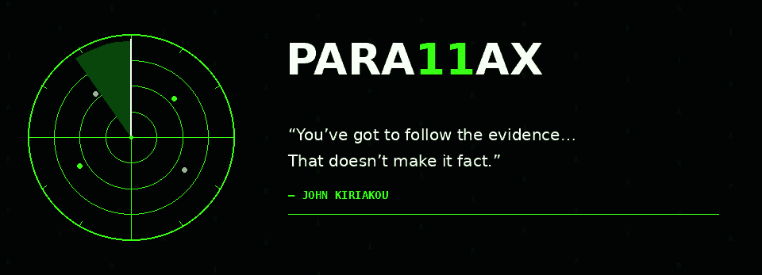
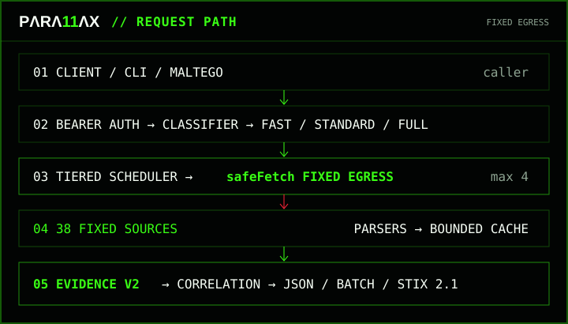
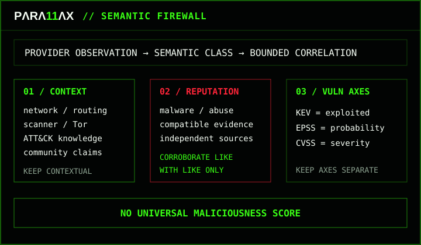

<div align="center">

<picture>
  <source media="(max-width: 720px)" srcset="assets/brand/para11ax-readme-hero-mobile-v5.gif">
  
</picture>

[](https://github.com/ger1e/para11ax/actions/workflows/tooling-smoke.yml)
[](https://github.com/ger1e/para11ax/actions/workflows/codeql.yml)

**INTELLIGENCE. ENRICHED. OPERATIONAL.**

`38 FIXED SOURCES` · `EVIDENCE V2` · `STIX 2.1` · `READ-ONLY` · `FIXED EGRESS` · `Node.js 24.x`

[**ENTER ANALYST UI**](https://para11ax.vercel.app/app/) · [Landing](https://para11ax.vercel.app/) · [API](docs/API.md) · [Architecture](docs/ARCHITECTURE.md) · [Providers](docs/PROVIDERS.md) · [Security](SECURITY.md)

</div>

> [!IMPORTANT]
> Personal research / lab surface. Do not send commercial-client, internal-enterprise, restricted, or otherwise sensitive data without explicit authorization and suitable data handling.

```text
analyst@para11ax:~$ core --status
> OPERATIONAL CORE
```

PARA11AX is a bounded CTI evidence gateway for hunters and defenders. It takes one supported observable, routes it through a fixed provider workflow, preserves provider-native semantics, and returns provenance-rich evidence without pretending every signal is a verdict.

- **Inputs:** IP · domain · URL · hash · CVE · ATT&CK ID · ASN · CIDR · certificate (`cert-sha256:<64-hex>`).
- **Profiles:** `fast` · `standard` · `full`; callers cannot select arbitrary providers.
- **Trust boundary:** `safeFetch` allows only declared HTTPS hosts, methods, protocols, body ceilings, and redirect behavior.
- **Execution:** tiered provider scheduling, bounded concurrency, bounded cache, explicit timeout/circuit states.
- **Outputs:** Evidence v2 · typed correlation · JSON · batch · STIX 2.1 · deterministic offline reports.
- **Identity:** repository/package `para11ax`, CLI `para11ax`, bearer `PARA11AX_TOKEN`, API base `/api/para11ax/*`.



`safeFetch` is the hard egress boundary. Callers cannot choose arbitrary destinations, protocols, methods, headers, redirects, provider credentials, or custom proxy routes. Upstream responses remain untrusted until a provider parser validates and normalizes them.

**Read-only means read-only:** no scanning, detonation, submission, sample download, takedown, remediation, or arbitrary proxying.

```text
analyst@para11ax:~$ surface --analyst
> ANALYST SURFACE // https://para11ax.vercel.app/app/
```

The production analyst terminal keeps the gateway bearer in volatile memory only, exposes bounded shell commands and evidence views, and preserves the same semantic model as the API.

### API

- `GET /api/para11ax/meta` — public static capabilities and hard limits.
- `GET /api/para11ax/health` — bearer-protected readiness.
- `GET /api/para11ax/status` — bearer-protected aggregate runtime state.
- `POST /api/para11ax/enrich` — one indicator, fixed workflow/profile only.
- `POST /api/para11ax/batch` — 1–20 indicators; max 3 active indicators / 200 calls.
- `POST /api/para11ax/stix` — enrich then export STIX 2.1; max 100 objects.
- Unknown `/api/para11ax/*` — controlled fail-closed API 404; browser content negotiation never changes API status semantics.

```json
{"indicator":"203.0.113.10","profile":"standard"}
```

Complete contract: [`docs/API.md`](docs/API.md).

### Operator CLI

```text
para11ax doctor
para11ax providers list
para11ax providers env-template
para11ax providers probe --all
para11ax maltego check
para11ax release verify
para11ax report compile <snapshot.json> --out <dir> [--preset <name>]
para11ax report diff <before.json> <after.json>
```

The browser terminal and CLI are control surfaces over bounded gateway behavior; neither is a general-purpose shell or arbitrary network client.

```text
analyst@para11ax:~$ semantics --enforce
> SEMANTIC FIREWALL
```



- **Absence ≠ benign:** `not_listed`, `not_found`, `no_result`, and `no_association` remain absence semantics.
- **Context ≠ reputation:** registration, routing, exposure, Tor, scanners, Modat, and ATT&CK cannot vote an IOC malicious.
- **Claims ≠ compromise proof:** community and ransomware reporting remain claim/report evidence.
- **Infrastructure ≠ attribution:** hosting, ASN, DNS, certificates, or malware proximity do not manufacture actor attribution.
- **KEV ≠ EPSS ≠ CVSS:** exploitation status, probability, and severity remain separate axes.
- **Failure ≠ negative evidence:** timeout, 429, 5xx, parser failure, and circuit-open states remain explicit coverage failures.

Full semantics: [`docs/EVIDENCE-SCHEMA.md`](docs/EVIDENCE-SCHEMA.md).

<details>
<summary><strong>38 upstream APIs and feeds</strong></summary>

**Identity / routing / exposure:** IPinfo · RDAP · RIPEstat · Shodan · Censys · Modat Magnify · Cloudflare Radar · Cloudflare DNS · Tor Exit · Spamhaus DROP / ASN-DROP.

**Threat / IOC:** DShield · Feodo Tracker · ThreatMiner · CIRCL MISP OSINT · Botvrij MISP OSINT · GreyNoise · AbuseIPDB · VirusTotal · OTX · ThreatFox · urlscan.io · Webamon · Pulsedive · OpenPhish · URLhaus · TweetFeed.

**File / malware:** CIRCL Hashlookup · MalwareBazaar · Malpedia · Hybrid Analysis.

**Vulnerability / ATT&CK:** CISA KEV · FIRST EPSS · CIRCL Vulnerability-Lookup · NVD · OSV · MITRE ATT&CK TAXII.

**Ransomware:** RansomLook · Ransomware.live API-PRO.

[`config/providers.json`](config/providers.json) is the machine-readable policy for supported types, evidence semantics, tiers, timeouts, pacing, cache TTLs, response ceilings, fixed hosts/methods/protocols, parser versions, source URLs, and distribution rules.

**Implemented ≠ configured ≠ production-verified.** Source presence, runtime secret state, and exact-deployment acceptance remain separate facts.

</details>

<details>
<summary><strong>Security and resilience</strong></summary>

- Bearer authentication protects private API surfaces; `/api/para11ax/meta` is intentionally public.
- Provider secrets stay server-side; Maltego receives only the gateway bearer.
- Exact fixed HTTPS hosts and declared methods/protocols; redirects refused.
- Streamed upstream bodies are byte-capped before parsing.
- Provider timeout + 20 s request deadline; max 4 providers concurrently.
- At most one retry for explicitly retryable conditions.
- Bounded instance-local circuit breaker and bounded LRU/TTL cache.
- Provider failures are never cached as negative evidence.
- Operational telemetry is allowlisted; raw indicators are excluded by default.
- Error responses are `no-store`, correlation-safe, and do not expose raw provider exceptions.

Security detail: [`docs/SECURITY-CONTROLS.md`](docs/SECURITY-CONTROLS.md) · [`docs/THREAT-MODEL.md`](docs/THREAT-MODEL.md) · [`SECURITY.md`](SECURITY.md).

</details>

<details>
<summary><strong>Maltego and deterministic reports</strong></summary>

Maltego crosses one credential boundary only: `PARA11AX_TOKEN`. Vendor credentials never enter the MTZ or transform output. See [`maltego/README.md`](maltego/README.md).

Report rendering never calls providers. It compiles frozen evidence through a canonical `ReportModel` and hard quality gate into deterministic HTML, PDF, text, JSON/STIX, CSV, KQL, ATT&CK Navigator, and SHA-256 manifest artifacts.

The gate rejects missing provenance, unsafe attribution, malformed ATT&CK IDs, impossible timestamps, duplicate observables, unsafe references, secret material, stale evidence presented as current, and unsafe sharing of restricted evidence.

</details>

<details>
<summary><strong>Verification and deployment</strong></summary>

Protected `main` requires the bounded `Tooling smoke` gate; CodeQL runs alongside it. The tooling gate performs repository invariants, deterministic dependency install/audit, Node tests, Maltego regression tests, Python compilation, shell checks, and PowerShell parsing.

Vercel Git deployment is disabled for `**` and enabled only for `main`. Repository-complete, configured, and production-complete are distinct states; production acceptance requires the exact deployed source SHA.

Full process: [`docs/OPERATIONS.md`](docs/OPERATIONS.md). Release identity: [`release-manifest.json`](release-manifest.json).

</details>

```text
analyst@para11ax:~$ docs --deep
> DEEP DOCS
```

- [`docs/BRAND.md`](docs/BRAND.md) — PARA11AX identity and canonical surface rules.
- [`docs/ARCHITECTURE.md`](docs/ARCHITECTURE.md) — execution model and trust boundaries.
- [`docs/END-TO-END-EXAMPLE.md`](docs/END-TO-END-EXAMPLE.md) — IOC → evidence → export walkthrough.
- [`docs/EVIDENCE-SCHEMA.md`](docs/EVIDENCE-SCHEMA.md) — Evidence v2 and correlation semantics.
- [`docs/PROVIDERS.md`](docs/PROVIDERS.md) — source semantics and provider state model.
- [`docs/API.md`](docs/API.md) — endpoint contracts and hard limits.
- [`docs/THREAT-MODEL.md`](docs/THREAT-MODEL.md) — threats, residual risk, executable checks.
- [`docs/SECURITY-CONTROLS.md`](docs/SECURITY-CONTROLS.md) — control-to-risk mapping.
- [`docs/OPERATIONS.md`](docs/OPERATIONS.md) — CI, production acceptance, incident behavior.
- [`SECURITY.md`](SECURITY.md) — repository security policy.
- [`docs/PUBLIC-RELEASE-CHECKLIST.md`](docs/PUBLIC-RELEASE-CHECKLIST.md) — public-extraction gate.
- [`release-manifest.json`](release-manifest.json) — deterministic release identity.

```text
analyst@para11ax:~$ gaps --show
> DELIBERATE GAPS
```

No TLS/JA3 without a bounded source that passes the source gate. No deprecated SSLBL C2 path. No stale SecurityTrails configuration. No unbounded ATT&CK relationship download. No ransomware-wide enumeration in per-indicator enrichment. No Modat bulk export/broad history path. **No universal maliciousness score.**

---

<div align="center">

`analyst@para11ax:~$ _`

**OBSERVED ≠ INFERRED ≠ CONTEXTUAL**

Preserve provenance · keep semantics separate · fail closed · make uncertainty visible

</div>
