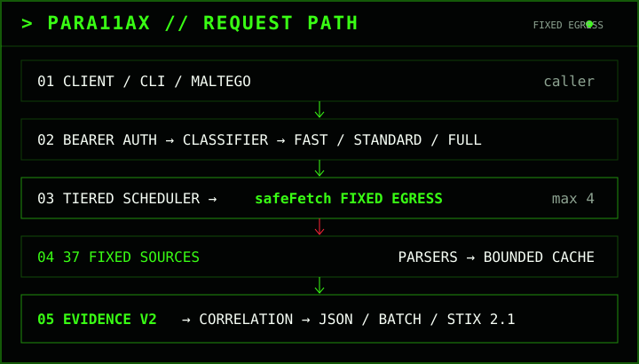

### PARA11AX Architecture

#### Purpose

The gateway is a public-source, read-only CTI enrichment service for personal research/lab use. It accepts one bounded indicator or a bounded batch, selects a fixed workflow, queries only predeclared provider destinations, normalizes evidence, correlates compatible observations, and returns provenance-preserving JSON or STIX 2.1.

The Evidence v2 enrichment core is not a scanner, detonation service, arbitrary HTTP proxy, submission service, takedown system, secret broker, autonomous remediation system or automatic blocking engine. PARA11AX also exposes one explicitly separate active OSINT capability: User Scanner email/username enumeration through an isolated worker. That path does not become an Evidence v2 provider or evidence source.

#### Architecture at a glance



The hard external boundary for passive CTI enrichment is `safeFetch`: callers cannot choose an arbitrary provider, destination, protocol, method, header or credential. Upstream data remains untrusted until a provider-specific parser converts it into bounded evidence.

User Scanner has a different and deliberately isolated boundary. The browser never calls the external scanner worker directly. The existing PARA11AX shell calls same-origin `POST /api/para11ax/user-scanner`; the gateway validates a bounded email/username request and forwards it only to the server-configured `PARA11AX_USER_SCANNER_URL`. This active OSINT route does not use `safeFetch`, does not share the fixed provider registry, and does not feed Evidence v2 correlation.

#### Request path

Passive CTI enrichment:

```text
Client / Maltego
  -> API auth and request limits (except public /api/para11ax/meta)
  -> strict canonical indicator classifier
  -> fixed workflow + fast|standard|full profile
  -> configured-provider filter
  -> tiered scheduler (max 4 providers concurrently)
  -> central safeFetch fixed-egress boundary
  -> provider parser
  -> bounded cache
  -> Evidence Schema v2 normalization + integrity fingerprint
  -> typed correlation / freshness / evidence quality / huntability
  -> deterministic decision support
  -> Evidence Graph v1.0 + Guidance v1.0 projections on ok/partial results
  -> JSON, bounded batch result, report bundle, or STIX 2.1 bundle
```

Isolated User Scanner active OSINT:

```text
Existing PARA11AX analyst shell
  -> gateway bearer authentication
  -> fixed user-scanner command grammar
  -> same-origin POST /api/para11ax/user-scanner
  -> scanType/target/category/module/crossScan/noNsfw validation
  -> server-configured PARA11AX_USER_SCANNER_URL only
  -> optional server-side PARA11AX_USER_SCANNER_TOKEN
  -> isolated Python User Scanner worker
  -> bounded result normalization
  -> terminal scrollback
  -> separate from Evidence v2 current-result/correlation/export state
```

Batch enrichment reuses the same classifier, profile selector and single-indicator orchestrator. It adds canonical de-duplication, max-three indicator concurrency, one shared deadline and a global provider-call reservation. There is no second provider-routing implementation.

The browser analyst surface adds a separate local workspace layer after gateway enrichment. Cases, exact typed cross-case sightings, snapshots, semantic diffs and `.para11ax` bundles persist only through browser-local IndexedDB. That layer does not create a server-side IOC history or a second provider/network path. User Scanner results are rendered in the same analyst shell but are not silently pinned into case evidence or reinterpreted as the current Evidence v2 result.

#### Trust boundaries

##### Caller -> gateway

Bearer authentication protects enrichment, batch, STIX, status, health/operations and User Scanner surfaces as documented by the API contract. Request size, media type and indicator/scan type are bounded before external execution. Caller input never chooses arbitrary provider hosts, worker hosts, methods, credentials, proxy routes or provider names.

##### Gateway -> provider

`safeFetch` enforces exact fixed hosts, declared HTTPS methods/protocols, redirect refusal and request/response byte ceilings. Provider credentials are read server-side only. A caller cannot turn the passive enrichment gateway into an open proxy.

##### Gateway -> User Scanner worker

User Scanner is an explicit active OSINT exception to the passive provider model, not an exception to destination control. The worker URL comes only from `PARA11AX_USER_SCANNER_URL`; callers cannot supply or override it. HTTPS is required except loopback HTTP for local development. The optional worker bearer comes only from `PARA11AX_USER_SCANNER_TOKEN`. The gateway rejects unknown request fields, caller-selected proxy/concurrency/timeout controls, invalid category/module names and category/module conflicts; worker responses are byte-bounded and normalized before returning to the shell.

Cross-scan remains opt-in at the shell/API layer. The reference worker fixes cross-scan depth to one and does not expose caller-controlled proxying, arbitrary files or bulk paths through PARA11AX. Active OSINT can contact many external services and may encounter rate limiting, WAF behavior or terms-of-service constraints; it must be used only for authorized defensive research.

##### Provider data -> evidence

Every upstream response is untrusted. Parsers fail closed on malformed structures. MISP correlations require exact, non-deleted attribute semantics. Provider failures remain failures and are never transformed into clean/not-listed evidence.

##### User Scanner output -> analyst

User Scanner results remain a separate OSINT envelope. A username hit means a platform/module reported a matching handle; an email registration result means the module observed registration-related evidence for that platform. Neither proves that profiles belong to the same person, that a person controls an account, that an account is current, that a target is compromised, or that the target is malicious. `Not Found`/`Not Registered` applies only to the specific module check. `Error` is coverage failure and never negative evidence.

The gateway preserves the scanner source, site/module-facing name, category, status, URL, bounded metadata and an operation ID/duration. It deliberately does not synthesize a universal identity confidence score or inject these results into Evidence v2 reputation/attribution logic.

##### Evidence -> analyst/export

Normalization preserves provider, parser version, retrieval time, cache state, duration and a canonical integrity fingerprint. Correlation is typed: scanner activity, Tor-exit status, registration/routing context and ATT&CK knowledge cannot become malware-reputation votes.

Decision support consumes only normalized evidence, typed correlation, coverage state and explicit relationships. It emits an explainable operational disposition, confidence tier, reasons, telemetry requirements, temporal context, ATT&CK mappings, an internal compact `decision.entityGraph`, and bounded hunt templates. It does not add evidence, infer actor attribution from infrastructure proximity, or execute hunts/remediation.

Train 5 adds two distinct top-level projections to normalized `ok`/`partial` responses:

- `evidenceGraph` — canonical Evidence Graph v1.0 with stable deterministic identity, explicit-only facts/relationships and hard bounds.
- `guidance` — Guidance v1.0 that inherits the existing decision/correlation semantics and can explain approved semantic-change categories without recalculating a second disposition or confidence model.

These are not replacements for `decision`. Error envelopes do not manufacture either projection.

Three graph concepts therefore remain intentionally separate:

```text
decision.entityGraph  -> compact decision-support pivots
evidenceGraph         -> canonical response Evidence Graph v1.0
browser case graph    -> local-only case/snapshot/exact-sighting projection
```

User Scanner active OSINT is a fourth, non-graph result surface and is not auto-promoted into any of those graphs.

##### Browser local workspace

Train 4 case state is local to the analyst browser. IndexedDB is the persistence adapter; active-case state and gateway bearer state remain runtime-only. Case graph/index rebuilds use exact typed values and do not parse free-form notes into entities. Local cases introduce no direct network persistence route.

##### Gateway -> telemetry/status

Operational telemetry is allowlisted and excludes raw indicators by default. Authenticated status is count-only and `Cache-Control: no-store`; it exposes configuration booleans rather than credential values.

#### Scheduling and resilience

- Provider concurrency: maximum 4.
- Single-request deadline: 20 seconds.
- Static per-workflow provider-call ceilings.
- Retry: at most one retry, only for timeout/transport/429/5xx conditions and only inside the remaining request budget.
- Circuit breaker: instance-local and bounded; default opens after three consecutive retryable failures for 60 seconds.
- Cache: bounded LRU/TTL, namespaces and in-flight de-duplication. Only successful observations are cached. Successful semantic negatives use the shorter negative TTL; transport/provider failures are never cached.
- Batch: max 20 inputs, max 3 active indicators and max 200 provider calls globally.
- STIX: max 100 generated objects.
- Evidence Graph v1.0: bounded explicit projection; current implementation caps nodes/edges independently and fails closed rather than silently inventing/truncating semantic claims.
- Generated hunt plan: max 8 entries.
- User Scanner gateway request body: max 4 KiB.
- User Scanner worker response: max 2 MiB before normalization; max 1000 returned result entries and 512 errored-site names.
- User Scanner gateway worker deadline: default 55 seconds, independently bounded from passive provider scheduling.

#### Analytical model

There is deliberately no universal maliciousness score. Evidence stays in semantic classes. Corroboration requires compatible independent observations; contradictions stay explicit.

For CVEs, KEV, EPSS and CVSS remain separate axes. Huntability is an operational mapping, not a threat-confidence or attribution score. Actor attribution is emitted only from explicit supporting evidence/relationships.

The decision-support layer is an operational synthesis, not a new evidence source. `hunt_now` means the existing evidence is sufficiently supported/current and directly huntable under the deterministic rules; it does not mean compromise is confirmed. Contradiction, staleness and material coverage loss downgrade confidence. Infrastructure-only observations remain context rather than threat confirmation.

Guidance v1.0 does not create a second scoring or decision engine. It carries the existing bounded disposition vocabulary (`hunt_now`, `investigate`, `monitor`, `context_only`, `insufficient`) and exposes evidence-backed reasons, limitations and semantic-change attention context.

User Scanner does not participate in that disposition vocabulary. Its output is analyst-facing identity/account OSINT and requires human interpretation under the explicit limitations above.

Telemetry readiness is schema-level only. Generated KQL identifies the expected Microsoft Defender XDR/Sentinel tables, but the gateway does not validate tenant ingestion, retention, table availability or client-specific field customization; `environmentValidated` therefore remains false until checked externally.

#### Indicator types

Implemented canonical Evidence v2 workflows:

- `ip`
- `domain`
- `url`
- `hash`
- `cve`
- `attack`
- `asn`
- `cidr`
- `certificate`

Certificate classification is explicit: `cert-sha256:<64-hex>`. A bare SHA-256 remains a file hash. The certificate workflow is bounded to contextual certificate metadata sources and does not manufacture a reputation verdict.

Email and username are supported as User Scanner targets in the separate active OSINT capability; they are not added to the canonical Evidence v2 observable registry by this integration.

ASN/CIDR support is limited to defensible fixed lookups. No TLS/JA3 indicator class is implemented because no current fixed, bounded source satisfied the source gate when v2 was built. ATT&CK relationship expansion is intentionally omitted where it would require an unbounded collection-wide fetch.

#### State labels

- **Implemented:** present in source and covered by repository verification.
- **Configured:** required runtime secret/environment configuration is present.
- **Production-verified:** an exact deployed source SHA has passed the specific authenticated/live checks being claimed.
- **Gap/omitted:** capability intentionally absent because its source, semantics or boundedness did not meet the design gate.

For User Scanner, distinguish PARA11AX gateway deployment from worker deployment and from wiring. A READY `user-scanner` Vercel project proves only that the worker deployment exists; successful hosted scans additionally require `PARA11AX_USER_SCANNER_URL` (and matching token when worker auth is enabled) in the PARA11AX production environment.

Repository verification is not production acceptance. Public deployment metadata is not proof of credentialed provider or User Scanner worker readiness. See `OPERATIONS.md`.
